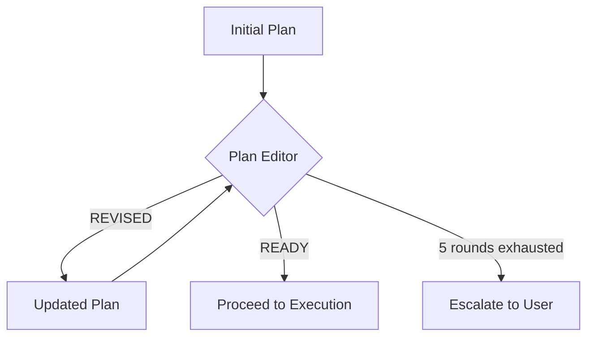

# Planning Deep Dive

The planning phase is where [[Trycycle Overview|Trycycle]] spends most of its intellectual effort. This note explores the plan-editing loop in detail, including convergence patterns observed in practice.

## The Plan-Edit Loop

Each editor round is **stateless**: the editor sees only the current plan and the original task input. It has no knowledge of how many rounds preceded it or what changes were made.[^convergence]

## Convergence Patterns

From early evaluations (see [[2026-03-15 Planning Experiments]]):

> [!info] Observation
> Plans typically converge in 2–3 rounds. Round 1 catches structural issues. Round 2 refines edge cases. By round 3, most editors judge the plan READY without changes.

The convergence rate $C(n)$ can be modelled as:

$$C(n) = 1 - e^{-\lambda n}$$

where $\lambda \approx 0.8$ based on observed data across $47$ planning sessions.

### Failure Modes

When the loop does *not* converge, common causes include:

1. **Oscillation** — Editor A prefers approach X, editor B prefers approach Y, they alternate
2. **Scope creep** — Each editor adds "just one more thing"
3. **Ambiguous requirements** — The task input leaves too much to interpretation

> [!danger] Anti-pattern
> If the plan is still being revised after round 4, something is fundamentally wrong. The 5-round limit exists to prevent infinite loops of well-intentioned refinement.

## Dataview-Style Fields

type:: technical-note
confidence:: high
last-reviewed:: 2026-03-16
word-count:: 847
planning-rounds-median:: 2

## Block References

The key insight about stateless editing: ^stateless-editing

> Each editor round spawns a fresh agent with no memory of previous rounds. This prevents groupthink and ensures each round is a genuine independent review. ^independent-review

This principle also applies to the [[Review Loop Mechanics#Review Independence|review loop]].

[^convergence]: This design was inspired by ensemble methods in machine learning, where independent weak learners combine to produce strong predictions.
