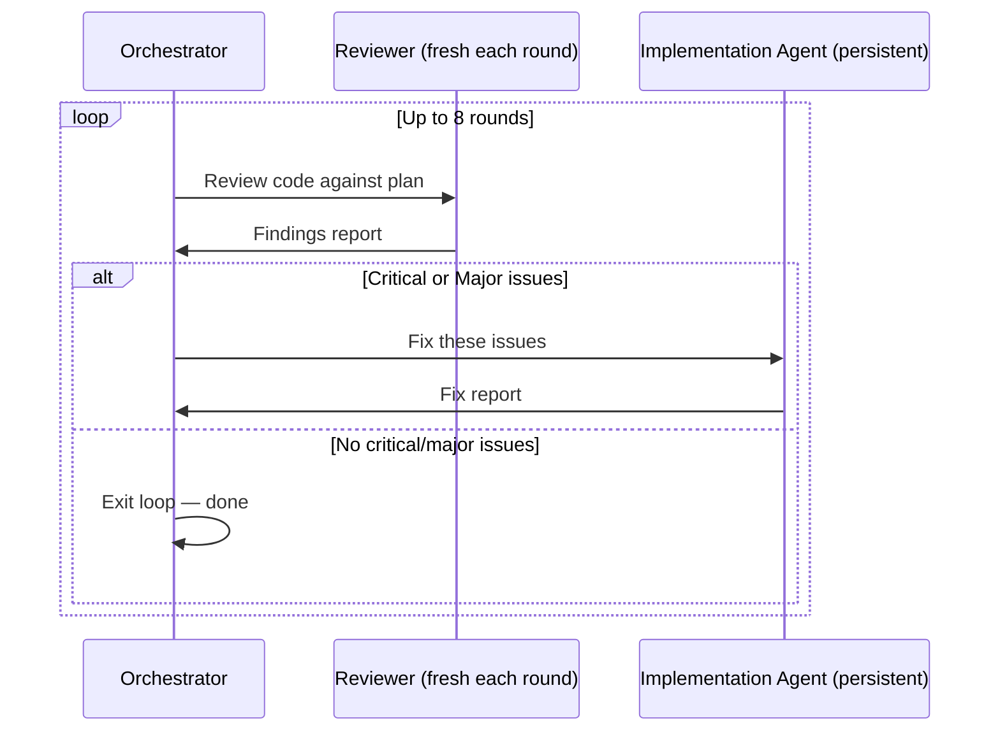

# Review Loop Mechanics

After [[Trycycle Overview|Trycycle]] finishes executing the implementation plan, a series of independent reviewers examine the code. This is the final quality gate before the work is presented to the user.

## Review Independence

> [!important] Design Principle
> Each reviewer is a fresh agent with **zero context** from previous review rounds. It receives only the implementation plan, the test plan, and the current state of the code.

This is the same principle described in [[Planning Deep Dive#^independent-review]].

## The Fix Loop

The review-fix cycle works as follows:

1. Spawn a fresh reviewer
2. Reviewer examines code against the plan
3. Reviewer categorises findings by severity:
   - **Critical** — Must fix before proceeding
   - **Major** — Should fix; significantly impacts quality
   - **Minor** — Nice to fix; low impact
   - **Suggestion** — Optional improvement
4. If critical or major issues exist, send findings to the (persistent) implementation agent
5. Implementation agent fixes issues and reports back
6. Repeat from step 1 with a fresh reviewer

## Severity Definitions

| Severity | Definition | Examples | Action |
|----------|-----------|----------|--------|
| Critical | Prevents correct operation | Missing error handling, data loss risk, security flaw | Must fix |
| Major | Significantly degrades quality | Poor performance, missing edge case, broken test | Should fix |
| Minor | Small imperfection | Style inconsistency, verbose code, missing comment | Nice to fix |
| Suggestion | Optional enhancement | Alternative algorithm, refactoring opportunity | Consider |

## Practical Results

In observed sessions, the review loop typically completes in $2$–$4$ rounds:

$$\Pr(\text{pass by round } r) = \begin{cases} 0.15 & r = 1 \\ 0.55 & r = 2 \\ 0.82 & r = 3 \\ 0.95 & r = 4 \end{cases}$$

The probability of needing all $8$ rounds is approximately $0.5\%$.

> [!tip] Efficiency
> Round 1 almost never passes because the reviewer has genuinely fresh eyes and no "implementation blindness." This is a feature, not a bug — it catches issues the implementer was too close to see.

## Tags and Cross-References

#trycycle #review #code-quality #hill-climbing

See also:
- [[Trycycle Overview]] for the full process
- [[Planning Deep Dive]] for how plans are strengthened
- [[Jesse Vincent]] for the original [[Superpowers]] design
